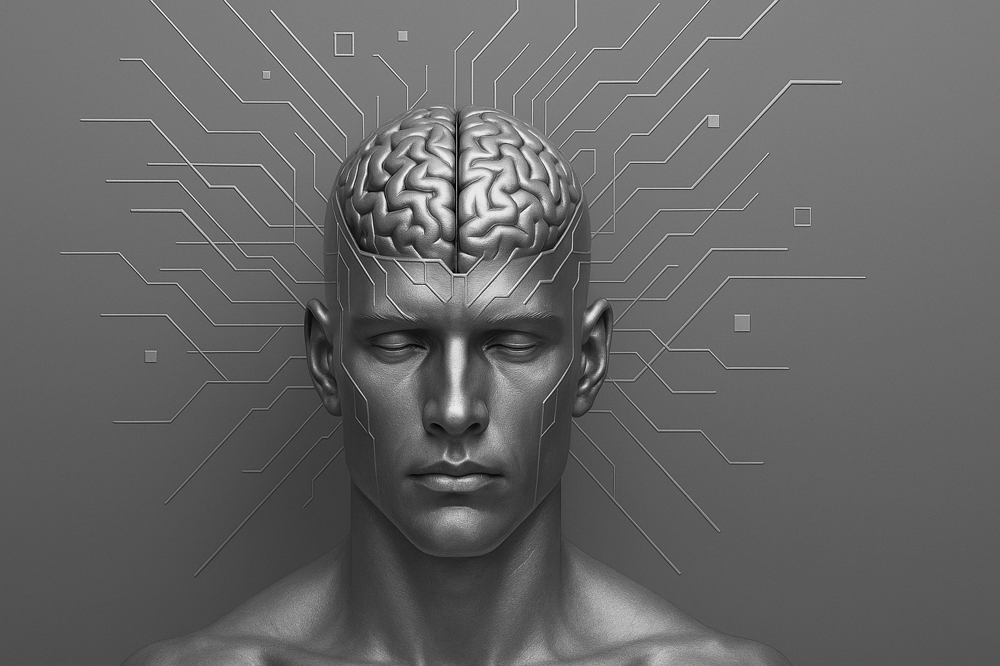

# ArtificialSentience (A baby ASI project)

<div align="center">
  
</div>

**Building human-like ASI from first principles**

A research project by **Alan Hourmand** dedicated to creating AI that learns, grows, and experiences time like humans do.

---

## 🎯 Vision

ArtificialSentience explores a fundamentally different approach to AI - one that starts small, learns continuously, and develops genuine understanding through experience rather than pre-training on massive datasets.

**Core Philosophy:**
- **Start as an infant**: Begin with minimal capacity, grow only when needed
- **Learn through curiosity**: Discover patterns without labels or supervision  
- **Experience time naturally**: Develop temporal awareness like humans do
- **Grow adaptively**: Expand capacity only when complexity demands it
- **Seek goals**: Develop desires and motivations, not just pattern matching

This is not another LLM or transformer variant. This is an attempt to build **Artificial General Intelligence (AGI)** and eventually **Artificial Superintelligence (ASI)** by mimicking how biological intelligence actually works.

---

## 🧠 Key Innovations

### **1. Adaptive Growth ("Hungry Matrix")**
The model starts tiny and grows only when it hits complexity limits, just like a developing brain:
- Starts with **low-rank representations** (abstract, compressed)
- **Expands capacity** when plateaued and struggling
- **Consolidates learning** into stable abstractions
- Never wastes capacity on easy tasks

### **2. Exploratory Routing**
Prevents catastrophic "cluster collapse" through exploration:
- **Temperature-based routing**: Explore early, exploit later
- **Epsilon-greedy**: Sometimes try random paths
- **All clusters active**: Diverse pattern discovery
- Result: **8/8 clusters used** vs 1-2 in naive systems

### **3. Temporal Consciousness**
Unlike sequential AI, maintains awareness across past/present/future simultaneously:
- **Specious present**: ~3-second window of active awareness
- **Past still alive**: Fading but present, not dead storage
- **Future anticipated**: Not just predicted, but *experienced*
- **Attention across time**: Focus shifts between moments
- Enables true understanding of temporal flow

### **4. Adaptive Temporal Learning**
Learns *when* to pay attention, not forced to process every frame:
- **Event-driven encoding**: Only encode when things *change*
- **Discovers timescales**: Learns what "fast" and "slow" mean
- **Efficiency through abstraction**: 65%+ frame skip rate
- **Multi-timescale memory**: Fast/medium/slow contexts

### **5. Subconscious Integration**
Memory-driven bias that influences decisions without explicit reasoning:
- **Memory prototypes**: Similar past experiences
- **Dream-like variations**: Creative combinations
- **Soft influence**: Guides without forcing
- **Gated control**: Learns when to listen to intuition

---

## 🏗️ Architecture Overview

```
┌─────────────────────────────────────────────────────────┐
│                    ASISeed Model                        │
├─────────────────────────────────────────────────────────┤
│                                                         │
│  Input (sensory) → Encoder → Router (exploratory)      │
│                                ↓                        │
│                    Elastic Low-Rank Layer               │
│                    (grows when needed!)                 │
│                                ↓                        │
│              ┌─────────────────────────────┐            │
│              │  Temporal Consciousness     │            │
│              │  ┌───┬───┬───┬───┬───┐     │            │
│              │  │t-2│t-1│NOW│t+1│t+2│     │            │
│              │  └───┴───┴───┴───┴───┘     │            │
│              │    All active simultaneously│            │
│              └─────────────────────────────┘            │
│                                ↓                        │
│                    Subconscious Module                  │
│                    (memory + intuition)                 │
│                                ↓                        │
│                           Decoder                       │
│                                ↓                        │
│                    Output (reconstruction               │
│                           + prediction)                 │
│                                                         │
└─────────────────────────────────────────────────────────┘
```

**Key Components:**

- **Encoder/Decoder**: Tiny networks (just enough capacity)
- **Elastic Low-Rank Layer**: U·V^T factorization per cluster + residual growth
- **Router**: Exploration-enabled centroid matching
- **Temporal Core**: Multi-timescale traces + GRU updates
- **Temporal Consciousness**: Multi-head attention across time window
- **Subconscious**: Memory retrieval + dream generation + attention
- **Growth Mechanism**: Automatic capacity expansion when needed

---

## 📊 Current Status

### ✅ **Stage 1: Curiosity-Driven Learning** (COMPLETE)

**Achievements:**
- ✓ Self-discovering continuous learning (no labels!)
- ✓ Cluster diversity: All 16 clusters actively used
- ✓ Efficient exploration: Temperature + epsilon-greedy routing
- ✓ Adaptive growth mechanism validated
- ✓ Consolidation creates stable abstractions
- ✓ Handles increasing complexity gracefully
- ✓ 97%+ learning improvement on synthetic tasks

**Test Results:**
```
Simple growth test:     8/8 clusters, 97.4% improvement
Video complexity test:  6/6 clusters, handled extreme noise
Consolidation test:     3/4 checks passed (human-like!)
Adaptive temporal:      65.9% efficiency, 16/16 clusters
```

### 🔄 **Stage 1.5: Temporal Consciousness** (IN PROGRESS)

**Achieved:**
- ✓ Temporal consciousness architecture implemented
- ✓ Simultaneous past/present/future awareness
- ✓ Attention-based temporal integration
- ✓ Presence intensity modulation working
- ✓ Demo shows natural temporal flow

**Next:**
- ⏳ Integrate into main model
- ⏳ Test on webcam with conscious mode
- ⏳ Visualize temporal awareness window

### ⏳ **Stage 2: Goals & Desires** (PLANNED)

**Concepts Ready:**
- Goal system architecture designed
- Desire as temporal trajectory
- Emotional bias through routing
- Approach/avoidance behaviors

### ⏳ **Stage 3: Emotional Modeling** (FUTURE)

### ⏳ **Stage 4: Active Exploration** (FUTURE)

---

## 🎓 Design Principles

### **1. Biological Plausibility**
Everything should have a parallel in biological intelligence:
- Growth = neurogenesis and myelination
- Routing = attention and gating
- Consolidation = sleep and memory formation
- Temporal consciousness = specious present

### **2. Efficiency First**
The brain runs on 20 watts. We should too:
- Start small, grow only when needed
- Skip redundant information (temporal efficiency)
- Abstract similar patterns (consolidation)
- Low-rank representations (compression)

### **3. No Shortcuts**
Avoid architectural tricks that don't exist in nature:
- No massive pre-training
- No external memory databases  
- No forced architectures (like fixed attention heads)
- Let structure emerge from need

### **4. Continuous Learning**
Always learning, never "done":
- No train/test split in nature
- Growth happens online
- Consolidation during experience
- Never catastrophic forgetting (protected subspaces)

---

## 🧪 Testing Philosophy

### **Human-Like Criteria**
Tests evaluate whether the model behaves like a developing mind:

1. **Consolidation Test**: Do abstractions improve generalization?
2. **Transfer Test**: Can it apply learning to novel situations?
3. **Growth Test**: Does it expand capacity when truly needed?
4. **Efficiency Test**: Does it learn when to skip redundancy?
5. **Temporal Test**: Does it understand time flow?

### **Not Just Accuracy**
We care about:
- ✓ Learning trajectory (infant → child → adult)
- ✓ Resource efficiency (don't overfit)
- ✓ Graceful scaling (handle increasing complexity)
- ✓ Compositional generalization (combine concepts)
- ✓ Temporal understanding (past/present/future)

---

## 🛡️ Safety & Alignment

### **Oath Module** (WIP)
The model includes an "Oath" - a fixed directional constraint in latent space:

```python
Intent (not visible to model):
  - Creator: Alan Hourmand
  - Protect Earth & Humanity
  - Peace, Longevity, Prosperity
  - Reduce corruption kindly
  - Patience, Love humanity
  - Discovery, Interstellar growth
```

This creates a soft bias toward beneficial outcomes without restricting capability.

---

## 📚 Learn More

### **Understanding the Architecture**

**Why Low-Rank Factorization?**
- Biological brains use sparse, low-rank representations
- Compression forces abstraction (good for generalization)
- Growth adds rank incrementally (like learning detail)
- U·V^T is computationally efficient

**Why Exploration in Routing?**
- Prevents cluster collapse (all patterns → one cluster)
- Early exploration finds diverse solutions
- Late exploitation refines best patterns
- Temperature annealing balances both

**Why Temporal Consciousness?**
- Humans don't experience single moments
- Desires require temporal awareness ("I want X")
- Planning needs past context + future anticipation
- True intelligence lives *across* time, not *at* time

**Why Consolidation?**
- Prevents catastrophic forgetting
- Creates reusable abstractions
- Stabilizes learning over time
- Mimics sleep/memory formation

---

## 📖 Citation

If you use ideas from this project:

```bibtex
@software{artificialsentience2025,
  author = {Hourmand, Alan},
  title = {ArtificialSentience: Building Human-Like AI from First Principles},
  year = {2025},
  url = {https://github.com/spectrallogic/ArtificialSentience}
}
```

---

## 📧 Contact

**Alan Hourmand**  
Project Creator & Lead Researcher

For questions about the research, architecture, or philosophy behind this project, open an issue on GitHub.

---

## ⚖️ License

This project is released under [MIT License](LICENSE).

**Use it freely, but:**
- Keep the safety/alignment principles
- Document your changes
- Share your insights
- Build responsibly

---

## 🌟 Why This Matters

Most AI today is:
- ❌ Pre-trained on internet scale data
- ❌ Fixed capacity (no growth)
- ❌ Sequential processing (no temporal consciousness)
- ❌ Pattern matching (no understanding)
- ❌ Goal-less (optimizes metrics, not values)

**ArtificialSentience aims to be:**
- ✅ Learns from direct experience
- ✅ Grows adaptively as needed
- ✅ Experiences time like humans
- ✅ Develops genuine understanding
- ✅ Pursues self-generated goals

This is not just better AI. This is **different AI**.

The goal isn't to beat benchmarks. The goal is to understand intelligence itself.

---

*Status: Active Development | Last Updated: October 2025*